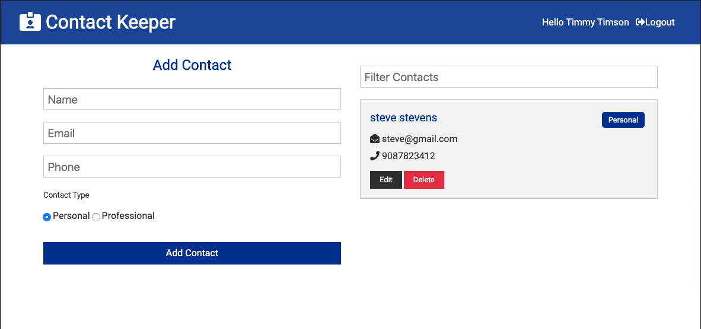

# Contact Keeper

Keep track of your personal and business contacts with this full stack (MERN) web application. Users can create a secure user account, login, logout, add, edit and delete personal and business contacts. Full CRUD app.

## Getting Started
### Prerequisites
Contact Keeper uses the following tools and frameworks
- concurrently - used in development to run api server and app simultaneously
- bcryptjs - encryption for user authorization
- config - to run in development and deployed environments
- express - web server framework
- express-validator - for validating user session
- jsonwebtoken - further secures user authorization using secure, encrypted web tokens
- mongoose - mongo database ORM
- react - front end framework
- axios - for making calls to api from server
- uuid (only in testing) for simulating user authorization to api

### To run Contact Keeper on your local machine open your CLI of choice
#### Clone to your local computer :octocat:
```sh
$ git clone https://github.com/androosk/contact-keeper.git
```
#### Install Yarn Dependencies
- cd into the root folder and run command
```sh
$ yarn install
```
- cd into the client folder
```sh
$ yarn install
```
#### Run Project
In the root folder
```sh
$ yarn dev
```
This opens an API server on localhost port 5000 and the app server on localhost port 3000

#### In your web browser go to address localhost:3000

## Deployment :link:
This app is deployed to Heroku at
https://secret-harbor-36540.herokuapp.com/

## License
This project is licensed under the MIT license

